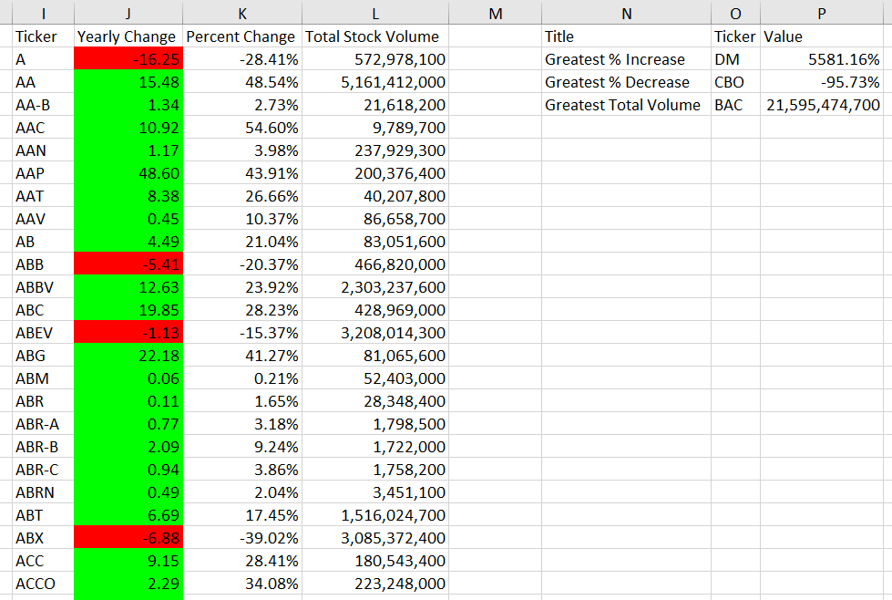
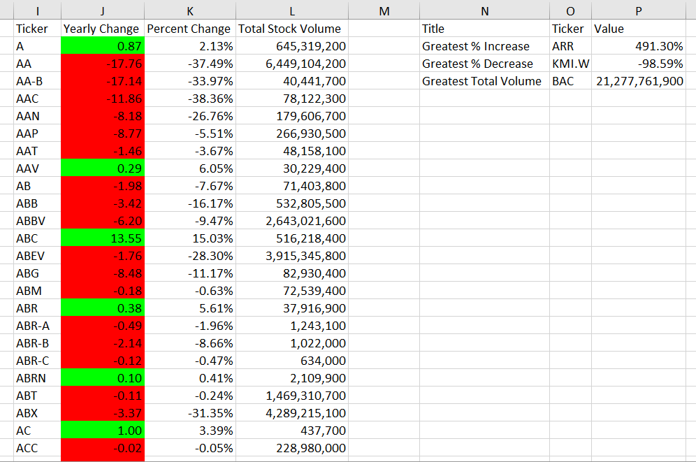
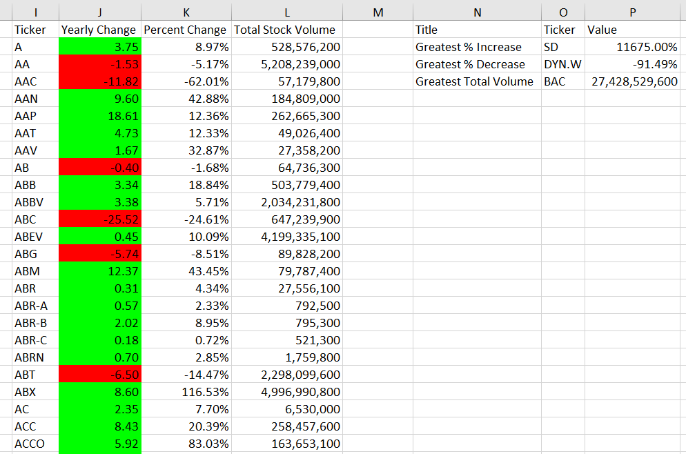

# Home Work Assignment - The VBA of Wall Street

## Assignment Scope

* Analyzing Stock data for the years 2014, 2015 and 2016. provided in an excel file, with each year in an worksheet.

* Here I used VBA to parse through each of the worksheet, and solved the following.

  * Yearly change from opening price at the beginning of a given year to the closing price at the end of that year.
  
  * The percent change from opening price at the beginning of a given year to the closing price at the end of that year.
  
  * The total stock volume of the stock.
  
  * You should also have conditional formatting that will highlight positive change in green and negative change in red.
  
  * Return the stock with the "Greatest % increase", "Greatest % Decrease" and "Greatest total volume".
  
  * Code that will loop through each of the years (worksheet)

### 2014 Stock Summary

### 2015 Stock Summary

### 2016 Stock Summary

### VBA Code to Analyze the data is attached as `.bas` file `VBACode_GaneshkumarG.bas`

### Detail Summary Images

Complete Summary are added as seperate file, but the image is too big.

`2014CompleteSummary_GaneshkumarG.png`

`2015CompleteSummary_GaneshkumarG.png`

`2016CompleteSummary_GaneshkumarG.png`
  
### Thank you 

This work is part of the `VBA Homework assignment` by `UOM Data Analysis and Visualization Bootcamp`.

Submited by : Ganeshkumar Gurunathan
